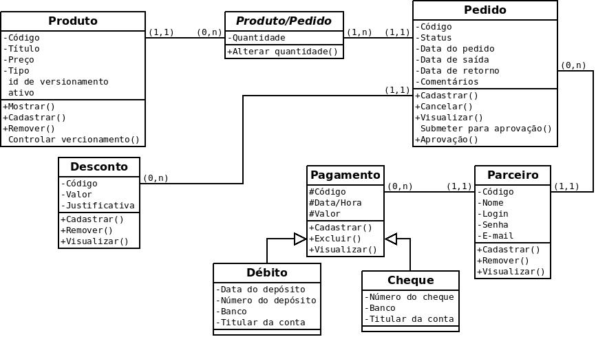

Este capítulo descreve, detalhadamente, o processo da construção da solução do problema descrito nos capítulos anteriores.

Requisitos Gerais
=================
Existem algumas regras e requisitos que regem o funcionamento do sistema que não necessariamente são de responsabilidade do banco e são elas:

=====   =====
**Requisitos Funcionais**
-------------
RF_01   Manter Produto.
RF_02   Manter Pedido.
RF_03   Manter Parceiro.
RF_04   Manter Pagamento.
RF_05   Manter Desconto.
RF_06   Gerar relatórios de pedidos e pagamentos.
RF_07   Gerar relatórios de produtos.
RF_08   Fazer versionamento de produtos.
=====   =====

=====   =====
**Regras de Negócios**
-------------
RN_01   Somente o administrador do sistema pode manter o produto.
RN_02   Somente a versão atual do produto é visivel para o sistema.
RN_03   As versões anteriores dos produtos tem função exclusiva de preservar histórico.
RN_04   A visualização do produto pelo parceiro é dada para a realização de pedidos.
RN_05   O pedido para ser validado deve ser aprovado pelo adiministrador do sistema.
RN_06   Pedidos que não contém produto de aluguel não possuem data de retorno.
RN_07   O parceiro pode adicionar, alterar e remover pedidos e consultar seu histórico.
RN_08   O pagamento é lançado pelo administrador do sistema.
RN_09   O relatório mensal é gerado através da soma de pedidos e pagamentos feitos até o início do presente mês, lançado como saldo anterior, seguido da discriminação dos pedidos e pagamentos do mês.
RN_10   O relatório de produtos é feito mostrando todos os produtos em sua versão atual, separados por tipo e em ordem alfabética.
=====   =====

Modelo Conceitual
=================
Abaixo, as modelagens conceituais apresentadas em diferentes formas.

Modelo Entidade Relacionamento
------------------------------

Notação "Peter Chen"
^^^^^^^^^^^^^^^^^^^^
.. image:: peter_chen_pi4.jpg
    :alt: Notação "Peter Chen"

Notação "Engenharia de Informação(James Martin)"
^^^^^^^^^^^^^^^^^^^^^^^^^^^^^^^^^^^^^^^^^^^^^^^^
.. image:: eng_inf_pi4.jpg
    :alt: Notação "Engenharia de Informação"

Diagrama de Classes
-------------------

Modelo Lógico
=============
Produto(**id**, codigo, titulo, preco, tipo, ativo)

Usuario(**id**, nome, login, senha, email)

Pedido(**id**, solicitante, data_solicitacao, data_saida, data_retorno, anotacoes)
    solicitante referência Usuario

Desconto(**id**, descontado, valor, justificativa)
    descontado referência Pedido

Produto_Pedido(**pedido, produto,** quantidade)
    produto referência Produto
    pedido referência Pedido

Pagamento(**id**, pagante, data, valor, anotacoes)
    pagante referência Usuario

Cheque(**id**, banco, numero, titular)
    id referência Pagamento

Debito(**id**, banco, numero, titular, data_deposito)
    id referência Pagamento
    