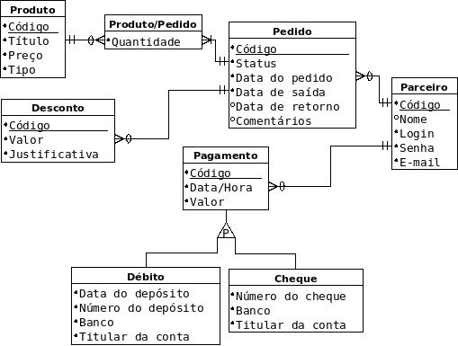

Este capítulo descreve, detalhadamente, o processo da construção da solução do problema descrito nos capítulos anteriores.

Requisitos Gerais
=================
Existem algumas regras e requisitos que regem o funcionamento do sistema que não necessariamente são de responsabilidade do banco de dados, e são elas:

=====   =====
**Requisitos Funcionais**
-------------
RF_01   Manter Produto.
RF_02   Manter Pedido.
RF_03   Manter Parceiro.
RF_04   Manter Pagamento.
RF_05	Manter Desconto.
RF_05   Gerar relatórios de pedidos e pagamentos.
RF_06   Gerar relatórios de produtos.
RF_07   Fazer versionamento de produtos.
=====   =====

=====   =====
**Regras de Negócios**
-------------
RN_01   Somente o administrador do sistema pode manter o produto.
RN_02   Somente a verção atual do produto é visivel para o sistema.
RN_03   As verções anteriores dos produtos tem função esclusiva de preservar histórico.
RN_04   A visualização do produto pelo parceiro é dada para a realização de pedidos.
RN_05   O pedido para ser validado deve ser aprovado pelo adiministrador do sistema.
RN_06   Pedidos que não contém produto de aluguel não possuem data de retorno.
RN_07   O parceiro pode adicionar, alterar e remover pedidos e consultar o balanço.
RN_08   O pagamento é lançado pelo administrador do sistema.
RN_09   O relatório mensal é gerado através da soma de pedidos e pagamentos feitos até o início do presente mês, lançado como saldo anterior, seguido da discriminação dos pedidos e pagamentos do mês.
RN_10   O relatório de produtos é feito mostrando todos os produtos em sua verção atual, separados por tipo e em ordem alfabética.
=====   =====

Modelo Conceitual
=================
Abaixo, as modelagens conceituais apresentadas em diferentes formas.

Modelo Entidade Relacionamento
------------------------------

Notação "Peter Chen"
^^^^^^^^^^^^^^^^^^^^
.. image:: peter_chen_pi4.jpg
	:width: 1024px
	:alt: Notação "Peter Chen"

Notação "Engenharia de Informação(James Martin)"
^^^^^^^^^^^^^^^^^^^^^^^^^^^^^^^^^^^^^^^^^^^^^^^^

Diagrama de Classes
-------------------
*TODO*

Modelo Lógico
=============
CATEGORIA_PRODUTO(*cod_categoria*, nome_categoria)

TIPO_PRODUTO(*cod_tipo*, nome_tipo)

COR_PRODUTO(*cod_cor*, nome_cor)

TEMA_PRODUTO(*cod_tema*, nome_tema)

PRODUTO(*cod_produto*, estoque_produto, preco_produto, cod_categoria, cod_tipo, cod_cor, cod_tema)

	cod_categoria referencia CATEGORIA_PRODUTO

	cod_tipo referencia TIPO_PRODUTO

	cod_cor referencia COR_PRODUTO

	cod_tema referencia TEMA_PRODUTO

COMPOSICAO(*cod_produto, cod_produto*)
	
	cod_produto referencia PRODUTO

	cod_produto referencia PRODUTO

PARCEIRO(*cod_parceiro*, email_parceiro, senha_parceiro, nome_parceiro, endereço_parceiro)

TELEFONE(*numero_telefone*, tipo_telefone, cod_parceiro)

	cod_parceiro referencia PARCEIRO

BALANCO(*cod_balanco*, data_balanco, saldo_anterior_balanco, cod_parceiro)

	cod_parceiro referencia PARCEIRO

PEDIDO(*cod_pedido*, status_pedido, data_pedido, data_saida_pedido, data_retorno_pedido, comentarios_pedido, cod_parceiro, cod_balanco)

	cod_parceiro referencia PARCEIRO

	cod_balanco referencia BALANCO

PRODUTO_PEDIDO(*cod_produto, cod_pedido*, quant_produto_pedido)

	cod_produto referencia PRODUTO

	cod_pedido referencia PEDIDO

PAGAMENTO(*cod_pagamento*, data_pagamento, valor_pagamento, banco_pagamento, titular_conta_pagamento, numero_cheque_pagamento, numero_deposito_pagamento, data_deposito_pagamento, cod_balanco)

	cod_balanco referencia BALANCO

Modelo Físico
=============
*TODO*

Interface
=========
*TODO*

Campos da interface
-------------------
*TODO*
