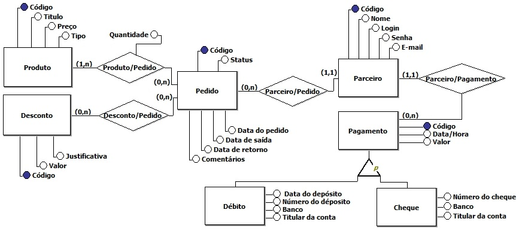

Este capítulo descreve detalhadamente o processo da construção da solução do problema descrito nos capítulos anteriores.

Requisitos Gerais
=================
Existem algumas regras e requisitos que regem o funcionamento do sistema que não necessariamente são de responsabilidade do banco e são elas:

=====   =====
**Requisitos Funcionais**
-------------
RF_01   Manter Produto.
RF_02   Manter Pedido.
RF_03   Manter Parceiro.
RF_04   Manter Pagamento.
RF_05   Geração automática do balanço do mês para cada parceiro.
RF_06   Vincular pedido ao ser aprovado ao balanço referente a data atual e ao cliente de origem do pedido.
RF_07   Vincular pagamento ao balanço referente ao mês do pagamento e ao cliente que o efetuou.
RF_08   Consultar saldo do mês.
=====   =====

=====   =====
**Regras de Negócios**
-------------
RN_01   Somente o administrador do sistema pode manter o produto.
RN_02   Somente produtos da categoria "composto” são composição de outros produtos.
RN_03   Somente produtos da categoria aluguel possuem estoque.
RN_04   O produto composto funciona como um modelo, ao se fazer um pedido de produto composto deve se fazer a checagem de disponibilidade de todos produtos de aluguel que o compõem.
RN_05   A visualização do produto pelo parceiro é dada para a realização de pedidos.
RN_06   O pedido somente poderá ser feito pelo parceiro se houver uma diferença mínima de 24h entre a data de saída e a data de realização do pedido.
RN_07   O pedido somente poderá ser desfeito ou alterado pelo parceiro se houver uma diferença mínima de 24h entre a data de saída e a data de cancelamento.
RN_08   Pedidos que não contém produto de aluguel não possuem data de retorno.
RN_09   Ao fazer pedido de um produto da categoria aluguel deve-se fazer a checagem de sua disponibilidade em estoque para aquele período através do cruzamento de todos os pedidos que tenham interseção de data de saída/retorno com o do pedido a ser feito, sendo vetada a realização de pedidos indisponíveis em estoque.
RN_10   Todo pedido concluído é submetido a aprovação do gerente do sistema.
RN_11   O parceiro pode adicionar, alterar e remover pedidos e consultar o balanço.
RN_12   O pagamento é lançado pelo administrador do sistema.
RN_13   A Geração automática do balanço do mês é feita ao inicio de cada mês passando para este o saldo do fechamento do mês anterior. Em caso de não haver balanço anterior o saldo anterior será zero.
RN_14   O Fechamento do mês anterior é a soma dos pedidos(débito) e pagamentos(crédito) do mês do fechamento com o saldo anterior(crédito ou débito).
RN_15   A consulta de saldo do mês é a soma de todos os pedidos e pagamentos referentes ao mês de consulta ao saldo anterior deste.
=====   =====

Modelo Conceitual
=================
*TODO*

Modelo Entidade Relacionamento
------------------------------

Notação "Peter Chen"
^^^^^^^^^^^^^^^^^^^^

Notação "Engenharia de Informação(James Martin)"
^^^^^^^^^^^^^^^^^^^^^^^^^^^^^^^^^^^^^^^^^^^^^^^^
.. image:: eng_inf_pi4.jpg
	:width: 1024px
	:alt: Notação "Engenharia de Informação"

Diagrama de Classes
-------------------
*TODO*

Modelo Lógico
=============
*TODO*

Modelo Físico
=============
*TODO*

Interface
=========
*TODO*

Campos da interface
-------------------
*TODO*
